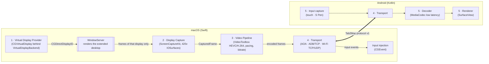
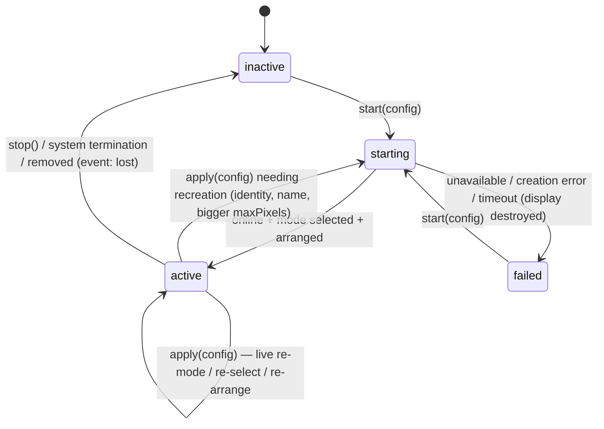

# Architecture

Tab2Mac makes a Galaxy Tab S11 a **real extended display** of a Mac. macOS creates and owns a virtual display, WindowServer renders the desktop onto it, and Tab2Mac captures, encodes and streams those pixels to the tablet, which only acts as the remote display surface. Input flows back the other way.

This document describes the architecture as built, and where it is headed. The code implements M1–M4 and the power work; M5–M7 (input, direct USB, Wi‑Fi) are implemented on both sides and await on-device verification. See [milestones.md](milestones.md). The constraints behind every decision are in [research.md](research.md).



## 1. Goals and non-goals

**Goals:**

- macOS sees a genuine display, and the brief's acceptance criteria follow from that:
  - it has its own `CGDirectDisplayID`;
  - it appears in System Settings › Displays;
  - the desktop extends onto it;
  - windows move to and from it;
  - its resolution, scaling, refresh rate, orientation and position can all be configured.
- The display **exists independently of the receiver**; its lifetime is a policy. A display the user created stays. One a tablet brought goes away `streaming.displayLingerSeconds` after the last tablet leaves (like Sidecar), and a tablet that reconnects sooner finds it unchanged.
- Lowest possible latency: wired first, then Wi‑Fi. Hardware encode and decode, zero-copy wherever the APIs allow.
- Energy efficiency: nothing is captured when nothing changes, and nothing is sent when nothing is captured.
- Loosely coupled Mac and Android implementations that can evolve independently.

**Non-goals (for now):**

- Mac App Store distribution (a private API is required).
- Windows or Linux hosts.
- Multiple tablets. The design leaves room for them, but they are not in scope.
- Audio.

## 2. Layers and their contracts

The brief mandates five layers. Each is a separate SwiftPM target (or Android module), so the dependency rules below are enforced by the compiler, not by convention.

| # | Layer | Mac module | Responsibility | Must not contain |
|---|---|---|---|---|
| 1 | **Virtual Display Provider** | `VirtualDisplay` (+ `CGVirtualDisplayBackend`, `CGVirtualDisplayShim`) | Create and destroy the display; define its modes, HiDPI, refresh rate and physical size; select a mode; arrange it; watch for mode, mirror and removal changes; expose the `CGDirectDisplayID` | Networking, encoding, Android logic, UI |
| 2 | **Display Capture** | `DisplayCapture` | Capture frames of *one* `CGDirectDisplayID` as timestamped, encoder-ready IOSurfaces; report capture statistics | Any knowledge of how the display was made |
| 3 | **Video Pipeline** | `VideoPipeline` | Pixel format handling, hardware encoding, pacing, keyframes, bitrate/quality control | Display creation, transport specifics |
| 4 | **Transport** | `Transport` + `Tab2MacProtocol` | Move encoded frames, control and input messages over USB or Wi‑Fi; framing, clock sync, reconnection | Display, capture or codec internals |
| 5 | **Android receiver** | `:protocol`, `:transport`, `:decoder`, `:renderer`, `:input`, `:discovery`, `:app` | Receive, decode, render; report capabilities; capture and send input | macOS concerns |

Two further pieces sit alongside the layers:

- **`Tab2MacSession`** wires the layers together. It holds configuration, the M1 verifier and the benchmarks, and it depends only on abstractions.
- **Composition roots** (`Tab2MacApp`, `t2m`) are the *only* code that picks a concrete `VirtualDisplayBackend`.

```text
Tab2MacApp, t2m ─► Tab2MacStreaming ─► Tab2MacSession ─► VirtualDisplay, DisplayCapture
      │                  ├─► VideoPipeline, Tab2MacProtocol, Transport, Tab2MacSecurity
      ├─► USBAccessory ─► USBAccessoryShim (Obj‑C, IOUSBHost), Transport
      ├─► InputInjection
      ├─► CGVirtualDisplayBackend ─► CGVirtualDisplayShim (Obj‑C, the private API)
      └─► EnergyMeter (t2m only)
                               everything ─► Tab2MacCore (clock, geometry, logging, statistics, metrics)
```

`DisplayCapture` doesn't import `VirtualDisplay` at all: the only thing it knows is a `CGDirectDisplayID`. The private API lives in exactly one Objective‑C file, `T2MPrivateVirtualDisplay.m`.

### 2.1 Layer 1 — the `VirtualDisplayBackend` boundary

```swift
@MainActor public protocol VirtualDisplayBackend: AnyObject {
    var identifier: String { get }
    func availability() -> BackendAvailability                        // isAvailable()
    func createDisplay(_ descriptor: VirtualDisplayDescriptor,        // createDisplay(configuration)
                       modes: VirtualDisplayModeSet,
                       onTermination: @escaping @MainActor () -> Void) throws -> CGDirectDisplayID
    func setDisplayModes(_ modes: VirtualDisplayModeSet) throws       // setDisplayMode(mode)
    var displayID: CGDirectDisplayID? { get }                          // getDisplayID()
    func destroyDisplay()                                              // destroyDisplay()
}
```

**The brief's operations, split two ways:**

- The **backend** does only what the private API has to do: create, re-mode and destroy.
- The **provider** does everything that public API can do: turning a configuration into a descriptor and mode set (`VirtualDisplayPlanner`), selecting a mode with `CGConfigureDisplayWithDisplayMode`, arranging with `CGConfigureDisplayOrigin`, handling mirroring, and monitoring with `CGDisplayRegisterReconfigurationCallback`. `start()`/`stop()` live on the provider.

This keeps the unstable surface as small as possible. How the backend verifies and wraps the private API is covered in [virtual-display-backend.md](virtual-display-backend.md).

**Provider state machine:**



**Details that were learned by measurement:**

- **Portrait** is a live mode-set swap on the same display. The private `rotation` field does nothing on 26.6.
- **`maxPixels` is square**, so either orientation fits without recreating the display.
- **Mode re-assertion.** For 3 s after start or apply, a mode change that we didn't make is treated as WindowServer restoring a saved mode, and the configured mode is re-selected. After that window, such changes are the user's choice (System Settings) and are only reported.
- **Auto-mirroring** of a freshly created display is undone, so it extends the desktop.

### 2.2 Layer 2 — capture

- `ScreenCaptureKitSource` (an actor) finds the `SCDisplay` for the ID, polling up to 15 s. It configures `420v` BT.709, the display's pixel size aspect-fit to the panel, `minimumFrameInterval = 1/(2·refresh)`, `queueDepth 5` and `showsCursor`.
- It delivers `CapturedFrame`s on a user-interactive queue. Each frame carries the IOSurface-backed `CVPixelBuffer`, the WindowServer `displayTime` and the arrival time.
- **The session** (not capture) restarts the stream on every display reconfiguration (FB17797423). It also retries with capped backoff when the stream stops, for example error −3808 on screen lock.
- **The display follows the tablet.** A display created because a tablet connected is removed `streaming.displayLingerSeconds` (default 15 s) after the last tablet disconnects, as with Sidecar. Windows return to the Mac's screens, and nothing is composed for nobody. A display the user created stays.
- **Capture runs on demand** (ADR‑15). `DisplaySession.setCaptureDemand(_:_:)` takes one flag per consumer (`.stream`, `.preview`); capture runs while any is set. A tablet that pauses (app in the background) withdraws its demand.
- `FrameSinkRegistry.latest` keeps the most recent frame while capture runs. A static screen produces no frames, so a new receiver, a keyframe request or a resume re-encodes that frame instead of waiting for the screen to change.
- **Display operations run one at a time** (ADR‑18). Start, apply, stop and the power-source switch each wait for the previous one. The provider's steps suspend while WindowServer catches up, and interleaving them once let a reconnecting tablet reuse a display that was being removed. `ensureDisplay(owner:)` creates the display only if none exists when its turn comes. A configuration the display can't follow is rolled back.
- **Capture starts and stops are chained the same way**, so two starts never overlap and orphan a stream.

### 2.3 Layer 3 — video pipeline (M2)

These settings come from the M4 measurements in research §3:

- **Main path: VideoToolbox HEVC Main** in *normal* rate-control mode, with:
  - `AllowFrameReordering=false` (no B-frames);
  - `RealTime=false`, or `ExpectedFrameRate` ≥ 2× the real rate (otherwise the encoder paces itself);
  - `AverageBitRate` adjusted live;
  - long GOP, keyframes on request.
  - Measured 5.5 ms at 1600p, sustaining 120 fps.
- **Fallback for lossy Wi‑Fi: low-latency H.264** with `MaxAllowedFrameQP≈51` and long-term reference (LTR) acknowledgements. Stay within level 5.2.
- **Zero-copy input:** the ScreenCaptureKit `420v` IOSurface goes straight into `VTCompressionSessionEncodeFrame`.
- **Pacing (latest frame wins):**
  - Up to two frames are inside the encoder, so one slow encode delays the next frame instead of dropping it; one more may wait.
  - A newer capture replaces the waiting frame, and the drop is counted.
  - Backpressure acts *before* encoding (ADR‑12): while two encoded frames are still queued in the socket, capture frames are skipped. Encoded frames are never dropped.
- **Rate limiting:** when the stream is capped below the display's refresh, `FrameCadence` picks frames on a fixed schedule from capture timestamps (exactly 60 fps from 120 Hz). At the display's own rate it steps aside, so timestamp jitter never costs a frame. A skipped frame that turns out to be the last before the screen goes still is sent after all (trailing frame).
- **Keyframes only on demand** (ADR‑17): a new receiver, KEYFRAME_REQUEST, resume or a new encoder.
- **Later (M9): idle refinement.** When the screen goes static, one high-quality frame follows the last change, so text becomes sharp.

### 2.4 Layer 4 — transport (M3, M6–M8)

The transport abstraction is split by delivery semantics, not by medium:

```swift
protocol ByteTransport       // reliable, ordered bytes: TCP (NetworkByteTransport) or AOA bulk pipes (AccessoryByteTransport)
final class MessageConnection // framing, backpressure and graceful close on top of any ByteTransport
protocol DatagramChannel     // unreliable: video fragments on Wi-Fi UDP (M8)
```

`StreamServer.accept(_:)` takes a `MessageConnection` from any transport. The TCP listener and the USB accessory coordinator both feed it, so HELLO/WELCOME, pause, keyframes and input work the same on every link.

| Link | Connector | Video delivery | Notes |
|---|---|---|---|
| USB, AOA 2 (primary, M6) | `AccessoryCoordinator`:<br>• IOKit notifications report Android devices.<br>• Only serials the user approved get the handshake (GET_PROTOCOL 51, SEND_STRING 52 ×6, START 53).<br>• An approved accessory-mode device (18D1:2D00/2D01) becomes a connection over its FF/FF interface's bulk pipes; revoking it, or turning direct USB off, ends the session.<br>• Vendor requests block for up to a second each, so they run on a dedicated queue.<br>• The Objective‑C shim `USBAccessoryShim` is the only IOUSBHost caller; devices are opened without capture or seize, so adb keeps working. | reliable stream | No developer mode. A ZLP follows writes that end on a packet boundary. **Verified:** GET_PROTOCOL = 2 on the Tab S11 with adb running. **Gate:** host→device throughput must be ≥ 3× the target bitrate, or ADB becomes the primary |
| USB, ADB reverse (fallback, M4) | `adb reverse tcp:…` using the user's adb; Mac listens on localhost | reliable stream (TCP) | Needs USB debugging. Reuses the TCP code path |
| Wi‑Fi TCP (M7) | Bonjour `_tab2mac._tcp`, TLS 1.3 | reliable stream | `TCP_NODELAY`, small send buffer, latest-frame-wins |
| Wi‑Fi UDP (M8) | Control over TLS; video over UDP with AES‑GCM keys exported from TLS | datagrams + Reed–Solomon FEC (10–20%) + NACK within a ~10 ms deadline, then LTR or IDR recovery | Packets ≤ 1200 bytes |

**Connection lifecycle:**

- **Receivers.** `StreamServer` keeps connections that are still saying HELLO, pairing or preparing in a small pending set (at most 4). One becomes *the* receiver only once it has completed the handshake and streams; only then does it replace the previous one ("replaced"). A connection that never authenticates can't displace anyone, and the streaming activity (no App Nap, no idle sleep) is held only for a receiver that is streaming and not paused. Turning a transport off (the adb listener, direct USB, Wi‑Fi) ends only that transport's sessions.
- **Leases.** Each receiver holds a `StreamLease` on the host (`prepareForStreaming()`). Pausing it withdraws that receiver's capture demand; releasing it (connection closed, even while the display was still being created) lets the display go after the linger. Releasing is idempotent.
- **Reconnection.** Android reconnects with backoff (0.25 → 5 s) and says HELLO again. The Mac answers with WELCOME, the stream format and a keyframe, re-encoded from the latest frame if the screen is static. (HELLO's `resume` token is reserved and not used yet.)
- **Display policy.** A display created because a tablet connected is removed `streaming.displayLingerSeconds` (default 15 s) after the last receiver disconnects, so windows return to the Mac. Set it to `null` to keep the display. A display the user created stays.
- **Clock sync.** NTP-style ping/pong (4 timestamps) every second. The minimum-RTT sample estimates the offset, which lets Android convert Mac capture timestamps into its own clock to measure **end-to-end latency** (capture → photons ≈ render time) per frame.

### 2.5 Adaptive bitrate (Wi‑Fi)

`BitrateController` (VideoPipeline) runs only on TLS (Wi‑Fi) sessions. USB links use a fixed bitrate cap (`streaming.bitrateKbps`) and skip adaptation.

- **Inputs, once per RECEIVER_REPORT** (every 250 ms on Wi‑Fi):
  - end-to-end p50;
  - frames the tablet dropped;
  - frames the Mac skipped because the link was still busy (backpressure).
- **Signal: queueing delay.** This is the end-to-end latency above its floor over the last 10 s. It rises before loss does.
- **Policy: AIMD.**
  - **Decrease:** congestion (queueing > 25 ms, any backpressure skip, any drop) multiplies the target by 0.7, at most once per 1 s.
  - **Increase:** otherwise, after a 2 s hold, the target grows by 4 % of the maximum per report.
  - **Limits:** 2–30 Mbit/s, starting at 12 Mbit/s.
- **Applied live** through `AverageBitRate` on the running session, so there is no keyframe and it settles in 0.5–1 s.
- **Later (M8):** UDP with FEC, and repeated unrecoverable loss switching to the H.264 low-latency + LTR profile.

### 2.5b Wi‑Fi sessions and pairing (M7)

- **Discovery.** `WiFiService` advertises `_tab2mac._tcp` over Bonjour. TXT records `pv`, `id`, `name`; no secrets.
- **Transport.** `TLSListener`: TLS 1.3 with this Mac's identity, and a tablet certificate required on every connection. Certificates are not chain-validated.
- **Mac identity.** A self-signed P‑256 certificate. `SelfSignedCertificate` builds it in DER, because macOS has no public API for that. It is kept in the login keychain.
- **Pinning.** The stream session pins certificates: `PeerTrust.tls` with `KeychainPinStore`.
- **Pairing: numeric comparison with commitments** (PROTOCOL.md §6, ADR‑20). An unknown tablet gets PAIRING `required`. The tablet commits to a random nonce, the Mac sends its nonce, the tablet reveals its own, and both screens show a 6-digit code over both certificates and both nonces.
  - `PairingExchange` is the Mac's side as a pure state machine; out-of-order, repeated or malformed steps, or a reveal that doesn't match the commitment, end the attempt.
  - The session waits for both users to confirm, then pins the tablet and sends `paired` and WELCOME. Until then, no video is produced and CONFIGURE and INPUT are ignored.
  - The Mac shows one prompt at a time and withdraws it when the tablet leaves. Rejections and a 2-minute timeout end the session.
  - Forgetting a tablet, or turning Wi‑Fi off, ends its session.
- **Tests.** A real mutual-TLS test runs with throwaway keychains, and the pairing flow is tested end to end over the protocol.

### 2.6 Layer 5 — Android receiver (M4+)

```text
:protocol   pure Kotlin/JVM; frame codec; shares golden test vectors with the Mac
:transport  AdbTcpTransport, AccessoryTransport (UsbManager/UsbAccessory), WifiTransport
:discovery  NsdManager (registerServiceInfoCallback, API 34+)
:decoder    MediaCodec async, FEATURE_LowLatency preferred, low-latency=1, vdec-lowlatency=1, KEY_PRIORITY=0
:renderer   SurfaceView; releaseOutputBuffer(i, System.nanoTime()); Surface.setFrameRate(120, FIXED_SOURCE); ADPF hints
:input      MotionEvent → protocol input (touch, S Pen pressure/tilt/hover/buttons); requestUnbufferedDispatch
:app        connection/status UI, diagnostics overlay, settings (Views + minimal Compose for settings)
```

- **Screen setup.** Immersive full-screen with `FLAG_KEEP_SCREEN_ON`, and `WIFI_MODE_FULL_LOW_LATENCY` on Wi‑Fi.
- **Rotation.** The activity follows the device; a rotation is sent to the Mac as a configuration request. The Mac re-modes the virtual display live (§2.1) and restarts capture and encode, and the next IDR arrives in the new orientation.
- **Targets.** minSdk 31, targetSdk 36 (Android 16). Targeting 37 would add the `ACCESS_LOCAL_NETWORK` runtime permission; handle it before raising the target.

### 2.7 Input path (M5)

Android sends normalized coordinates (0…65535), timestamps, pointer IDs and tool types. The Mac maps them into `CGDisplayBounds(displayID)` and posts `CGEvent`s at the HID tap. This needs the Post Event privilege, and the suppression interval is set to 0.

| Tablet | Mac |
|---|---|
| One-finger tap / drag | Left click / drag |
| Long press | Right click |
| Two-finger pan | Pixel scroll with phases (momentum: later) |
| Pinch | Not mapped yet (planned: ⌘+ / ⌘−) |
| S Pen in range / out of range | Tablet proximity events (pen or eraser, device ID, capabilities), as a Wacom driver or Sidecar's Apple Pencil sends them |
| S Pen hover | Tablet points with pressure 0: drawing apps show their brush preview |
| S Pen down/move/up | Left mouse with the `TabletPoint` subtype, pressure 0–1, tilt X/Y, tied to the proximity's device ID |
| S Pen eraser | Proximity as an eraser pointer: drawing apps switch to their eraser |
| S Pen side button | Right click |

Nothing stays pressed when things go wrong: a receiver that goes away mid-gesture has its button or scroll released (`InputInterpreter.reset()`), and a new gesture first releases one whose end never arrived.

**The S Pen is a pen tablet to macOS**, which is how Sidecar makes the Apple Pencil work: apps that support pen tablets (Photoshop, Affinity, Krita, Pixelmator…) draw with pressure and tilt. Verified with the real pen: pressure 0–0.89 and tilt −0.2…0.73 over one scribble, with proximity in and out as the pen hovered.

**The pointer is a side channel** (PROTOCOL.md §3.3b) when the tablet draws it (feature `cursor`). Capture leaves it out of the video (`showsCursor = false` while every receiver draws it), `CursorTracker` follows it with mouse-move monitors (nothing polls), and the tablet draws it above the video. Moving the pointer over a still screen then costs a 24-byte message instead of a captured, encoded and decoded frame, and the pointer moves with the link's latency rather than the video pipeline's. The shape comes from `NSCursor.currentSystem` (marked for future deprecation); without it, the pointer stays in the video.

## 3. Threading, timing and backpressure

| Context | Work |
|---|---|
| Main actor | Display provider, CoreGraphics configuration, UI, session orchestration |
| `dev.tab2mac.capture.frames` (user-interactive) | ScreenCaptureKit callbacks, statistics, fan-out to sinks (preview, encoder) — must never block |
| VideoToolbox callback threads (M2) | Encoded output into the transport queue |
| Network / USB queues (M3+) | Framing, send and receive, clock sync |

- **One clock.** `MediaTime` is `mach_absolute_time` converted with the host timebase (125/3 on Apple Silicon). It is the same clock as ScreenCaptureKit's `displayTime` and CoreMedia's host clock.
- **Backpressure.** The encoder's pacer keeps one waiting frame at most (the newest wins); the socket holds at most two encoded frames before capture frames are skipped. Capture surfaces must be released within `minimumFrameInterval × (queueDepth − 1)`.
- **Power** (ADR‑14, ADR‑15):
  - Frames exist only when content changes, and capture runs only while a consumer (a streaming tablet, the visible debug preview) needs it.
  - `beginActivity(.userInitiated, .latencyCritical)` (no App Nap, no idle sleep) is held only while a receiver is streaming and not paused.
  - Nothing polls: USB and adb are event-driven, and diagnostics sample only while a window shows them.

### Latency budget (wired target, p50)

| Stage | Budget | Basis |
|---|---|---|
| Composition → capture callback | ≤ 4 ms | M1 benchmark measures it |
| Encode 2560×1600 HEVC | ≤ 6 ms | 5.5 ms measured on M4 |
| USB transfer of ~100–300 KB | ≤ 3 ms | To be measured in M6 |
| Decode (Dimensity 9400+) | ≤ 10 ms | **Risk**: 20–30 ms seen on older Dimensity |
| Wait for vsync @120 Hz | ≤ 8.3 ms | Panel |
| **Total** | **≤ 30 ms** (Wi‑Fi ≤ 50 ms) | Measured end to end via clock sync (M4) |

## 4. Protocol (summary)

The full draft is in [protocol/PROTOCOL.md](../protocol/PROTOCOL.md).

- **Messages.** A 12-byte binary header (magic `T2`, version, type, flags, stream, length), then either:
  - **JSON** for infrequent control messages (hello and capabilities, welcome, config, stats, errors). Unknown fields are ignored, so either side can evolve independently.
  - **Compact binary** for hot-path messages (video frames, input, ping, acks). Fields may only be *appended*; receivers skip trailing bytes they don't understand.
- **Negotiation.** Protocol version ranges and feature lists are exchanged in HELLO/WELCOME.
- **Compatibility.** Golden test vectors in `protocol/test-vectors/` are consumed by both the Swift and Kotlin test suites.

## 5. Security

- **USB:** physical trust. The tablet user must accept the AOA or ADB prompt, and no encryption is used by default. Direct USB only gives a session to devices the Mac's user approved: any USB gadget can claim to be in accessory mode, and a session shows the screen and accepts input.
- **Wi‑Fi:**
  - The Mac's screen content must never be receivable by any LAN host.
  - **Pairing:** TLS 1.3 with self-signed keys and **numeric comparison with commitments**. Both screens show a 6-digit code derived from both certificate fingerprints and a nonce from each side; the tablet commits to its nonce first, so a man in the middle gets one guess per attempt. The user confirms the codes match. Pins are stored in the Keychain and the Android Keystore.
  - **UDP video** is encrypted with AES‑GCM keys from the TLS exporter.
  - Input is only accepted on an authenticated session.
- **Discovery:** Bonjour TXT records contain no secrets (protocol version, an instance ID taken from the Mac's certificate fingerprint, the Mac's name).
- **The adb path is authenticated with a token.** Over `adb reverse`, the tablet's connection reaches the Mac as a loopback connection from the adb server. Any process on the Mac could open the same port, and any app on the tablet could reach it through the reverse forward; either would receive the screen through Tab2Mac's Screen Recording grant and inject input through its Accessibility grant. So the Mac hands the Tab2Mac app a random token per run over adb (a broadcast to a receiver that requires `DUMP`, which only `adb shell` holds, with the token on stdin so it never appears in a process list) and requires it in HELLO (ADR‑21). Debug builds of the tablet app are `run-as`-readable over adb, so only release builds keep the token from someone who already controls adb.

## 6. Configuration and diagnostics

- **Configuration file:** `~/Library/Application Support/Tab2Mac/config.json`. It is versioned, and every section decodes with defaults, so files only contain what they change. Examples are in [`config/examples/`](../config/examples); a test keeps them valid.
- **Logging:** unified logging, subsystem `dev.tab2mac`, one category per layer, messages as `event.name key=value …`:

  ```sh
  /usr/bin/log stream --level debug --predicate 'subsystem == "dev.tab2mac"'
  ```

- **Diagnostic mode** (preview overlay and control panel):
  - capture FPS, frames, idle frames;
  - capture latency p50/p95 and interval jitter;
  - output size and format;
  - process CPU and memory, and system GPU utilisation (IORegistry `PerformanceStatistics`).
  - the stream: codec and size, sent fps and bitrate, skipped frames, encode p50/p95, and the tablet's end-to-end and decode latency and dropped frames.
- **Reports:** `t2m verify`, `Tab2Mac --self-test` and `--benchmark-capture` write JSON reports that include host information.

## 7. Language choice: Swift, not Rust

Swift was chosen for the whole macOS side:

- **Frameworks.** Every layer on the Mac is Apple-framework work: private Objective‑C (CGVirtualDisplay), ScreenCaptureKit, VideoToolbox, Network.framework, IOUSBHost, AppKit/SwiftUI and CGEvent. Swift reaches them directly. Rust would need `objc2`/FFI bindings for all of them, with no platform-independent logic left to amortize the cost.
- **Private-API isolation.** Catching `NSException`s from a private API needs Objective‑C `@try`, which rules out pure-Swift *and* pure-Rust shims. The shim is about 350 lines of Objective‑C.
- **Protocol sharing.** The protocol is implemented natively on each side and verified against shared golden vectors. That keeps the two apps loosely coupled; a shared Rust core would tie their release trains and toolchains together, cross-compiled for the NDK and bound through JNI.
- **Future Rust.** If a CPU-heavy, portable component ever appears (for example a software FEC codec), it can be written in Rust behind a C ABI without changing the layering.

## 8. Decision log

| # | Decision | Why | Revisit when |
|---|---|---|---|
| ADR‑1 | Swift for macOS, Kotlin for Android | §7 | — |
| ADR‑2 | Private `CGVirtualDisplay` behind `VirtualDisplayBackend`; runtime-verified; Objective‑C shim | No public API (research §1) | Apple ships a public API → add a backend |
| ADR‑3 | Portrait = live mode-set swap; square `maxPixels` | `rotation` ineffective on 26.6 **[M]** | `rotation` starts working |
| ADR‑4 | ScreenCaptureKit, `420v`, 1/(2·refresh) interval, restart stream on every display change | Research §2; FB17797423 | — |
| ADR‑5 | HEVC normal mode, no reordering, `RealTime=false` (H.264 low-latency + LTR as the lossy-Wi‑Fi profile) | M4 measurements (research §3) | Android decode can't keep up, or LTR is needed |
| ADR‑6 | AOA primary wired, ADB-reverse fallback, no tethering | Research §5.1 | AOA throughput gate fails |
| ADR‑7 | Wi‑Fi: TCP first, then UDP + FEC + LTR/IDR recovery | Research §5.2 | — |
| ADR‑8 | Protocol: binary header + JSON control + append-only binary hot path; golden vectors | Loose coupling with low overhead | — |
| ADR‑9 | Mac advertises Bonjour, Android discovers | Android 17 local-network rules (research §5.3) | — |
| ADR‑10 | swift-testing via `scripts/test.sh` (Command Line Tools only, no XCTest) | Development environment | — |
| ~~ADR‑11~~ | *Superseded by ADR‑14.* Virtual display at 120 Hz by default, stream capped at 60 | The "60 Hz composes at 6–22 fps" measurement was an artifact: the load window was created with `NSWindow(contentRect:screen:)`, which reads the rect relative to that screen, so it landed on another display. Fixed; 60 Hz streams 60.0 fps with a regular cadence **[M]** | — |
| ADR‑12 | Backpressure *before* encoding (skip capture frames while ≥2 frames are queued in the socket); encoded frames are never dropped | Every P-frame depends on its predecessor; dropping after encode corrupts the stream until the next IDR | UDP profile with LTR (M8) |
| ADR‑13 | Input delivered to the main queue (FIFO), not per-event Tasks | Unstructured Tasks don't guarantee order; down/move/up must never reorder | — |
| ADR‑14 | **Power first:** virtual display at 60 Hz by default and stream rate = display rate; 120 Hz is an opt-in "performance" setting. Surplus frames, when a cap applies, are dropped in-process by `FrameCadence` on capture timestamps | Streaming a continuously animated window costs +229 mW at 60 Hz → 60 fps. It costs +672 mW at 120 Hz → 60 fps with a regular cadence, and about 0.8 W more than 60 Hz at 120 Hz → 120 fps (`t2m bench-power`) **[M]**. Apps on the display also render half as often. ScreenCaptureKit's own `minimumFrameInterval` dropping is lossy with 120 Hz → 60 (50 fps, p95 interval 33 ms), while in-process cadence gives exactly 60.0 fps (p95 16.7 ms) **[M]** | — (done: `power.batteryRefreshRate`, 60 by default, switches a 120 Hz display to 60 Hz on battery, live) |
| ADR‑15 | **Nothing runs when nothing changes:**<br>• Capture runs only while a consumer (stream, preview) needs it, and a tablet whose app is in the background pauses the stream (CONFIGURE `paused`, feature `pause`).<br>• A static screen is never re-sent: keyframes needed by a new receiver, a keyframe request or a resume come from re-encoding the latest frame.<br>• The adb bridge is event-driven (`adb track-devices`).<br>• Diagnostics sample only while a window showing them is visible.<br>• A latency-critical activity (no App Nap, no idle sleep) is held only while a tablet is connected. | Static desktop while streaming: Tab2Mac 0.1 % CPU, 0 mW, 0 wake-ups/s **[M]**. The control panel alone cost ~8 % CPU when it re-rendered every 0.5 s | — |
| ADR‑16 | Energy is measured with IOReport's "Energy Model" channels (no root) in the developer CLI only; the app never links IOReport | Needed to judge changes by energy (the reference is Sidecar); IOReport is private, so it is resolved at runtime with every symbol checked, like the display shim | A public energy API |
| ADR‑17 | Keyframes only on demand (new receiver, KEYFRAME_REQUEST, resume, encoder change), never periodic; up to 2 frames in the encoder | IDRs at 2560×1600 take up to 31 ms (> 8.3 ms at 120 Hz) and spike the bitrate. All links are reliable, and the tablet asks on any gap. Result: 120 Hz with 0.06 % single-frame skips and a 14 ms worst case **[M]** | A lossy UDP profile (M8) needs periodic refresh or LTR |
| ADR‑18 | Display operations are serialized in `DisplaySession` (start, apply, stop, power switch each await the previous); `ensureDisplay(owner:)` decides "create or reuse" when its turn comes | The provider suspends while WindowServer catches up (up to its online timeout). Interleaved, a tablet reconnecting just as the linger expired reused a display that was being removed and streamed nothing (a regression test covers it) | — |
| ADR‑19 | Receivers: a pending set for connections that haven't authenticated, one current receiver, a `StreamLease` per receiver | Anyone who can reach the port can open a connection; it must not evict the tablet in use, hold the Mac awake, or strand a display by leaving during setup (a regression test covers it) | Multiple tablets |
| ADR‑20 | Wi‑Fi pairing by numeric comparison with a commitment to the tablet's nonce (as in Bluetooth LE Secure Connections) | Without nonces, a man in the middle can search certificate serials offline until both 6-digit codes match (~10⁶ hashes); with them it gets one guess per attempt | A pairing standard on both platforms (e.g. passkeys) |
| ADR‑21 | adb connections authenticated by a per-run token handed to the app over adb (DUMP-protected receiver, token on stdin) and required in HELLO | A loopback port is open to every local process on the Mac and, through `adb reverse`, to every app on the tablet; either would get the screen and input through Tab2Mac's grants | A transport with its own peer identity |
| ADR‑22 | The pointer as a side channel (CURSOR/CURSOR_SHAPE) when the tablet draws it; capture leaves it out | Pointer motion over a still screen otherwise costs a captured, encoded and decoded frame per refresh (up to 120/s); now a 24-byte message. Verified on the device: the overlay draws it at the exact position | ScreenCaptureKit offering the pointer as metadata |
| ADR‑23 | Liveness on both sides (receivers PING at 1 Hz; the Mac drops 5 s of silence, the tablet 4–5 s), a HELLO on a live link restarts the session, GOODBYE `shutdown` on quit | A USB accessory link reports neither a dead tablet app nor a quit Mac; without this, both sides waited forever. Verified on the device: kill the tablet app, or quit the Mac app, and the stream comes back by itself | — |
| ADR‑24 | The S Pen is a pen tablet to macOS (proximity events, tablet points with pressure and tilt, eraser pointer) | That is what drawing apps read, and how Sidecar presents the Apple Pencil; verified with the real pen (pressure 0–0.89, tilt, proximity in/out) | — |
| ADR‑25 | No-router mode: the tablet creates a Wi‑Fi Direct group (5 GHz, new passphrase per session), hands its credentials to the Mac over Bluetooth LE sealed with a per-tablet key delivered over an authenticated session, and the Mac joins with CoreWLAN only on its user's click, then returns to its previous network by cooperating with macOS auto-join (GOODBYE first so the tablet drops its network; leave; wait; join from the last scan; cycle the radio only when on no network) | Wi‑Fi Aware (NAN) would avoid the Mac's network switch and the Tab S11 supports it, but `WiFiAware.framework` in the macOS 26 SDK marks every symbol `@available(macOS, unavailable)`. When Apple opens it on macOS, it enters as one more `ByteTransport` (publish on the tablet, subscribe on the Mac, TLS + pinning unchanged) | Apple ships WiFiAware on macOS |
| ADR‑26 | A tablet's hardware keyboard is forwarded as USB HID usages (KEY), and the Mac applies its own layout; ⊞/Samsung → ⌘ by default, as macOS does for PC keyboards | Physical keys work with every layout (ABNT2 included) and every app, as Sidecar does with an iPad keyboard | — |
| ADR‑27 | A display created for a tablet takes that device's panel (profile by model, else from HELLO), its refresh is capped by the panel, and the stream by the decoder | One configuration serves a Tab S11, a Tab S9 FE+ (90 Hz), a phone; macOS remembers each device's arrangement by its identity | — |

