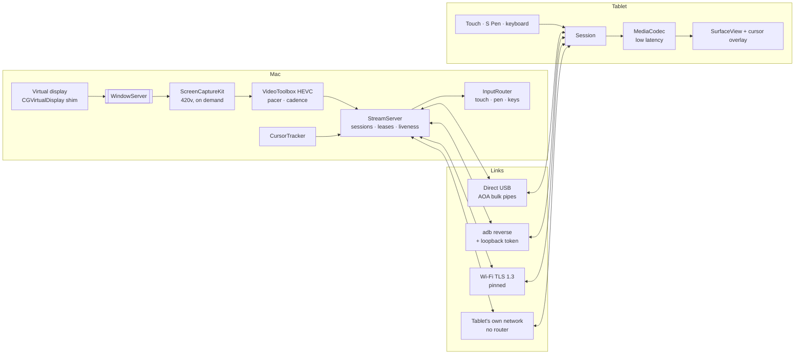
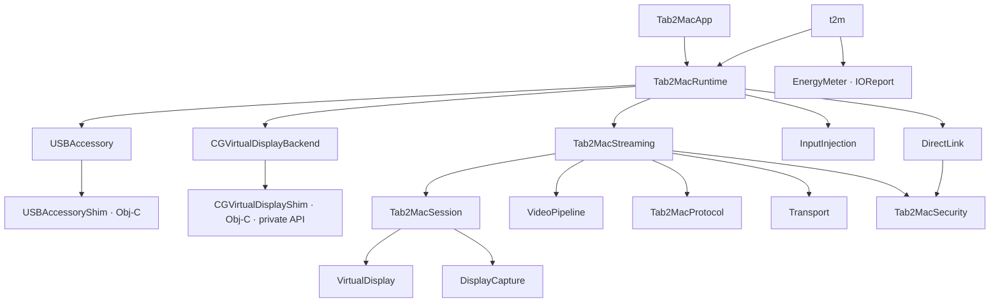
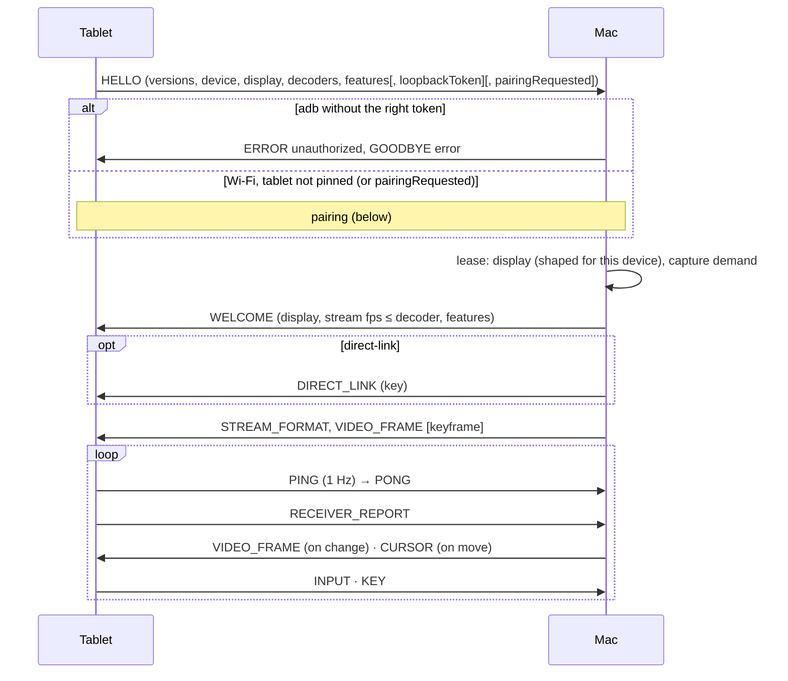
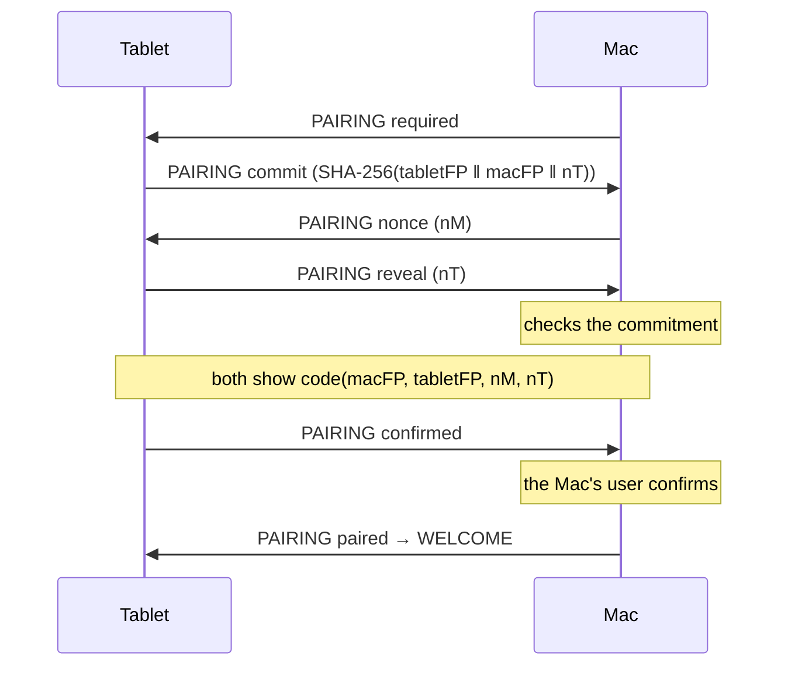
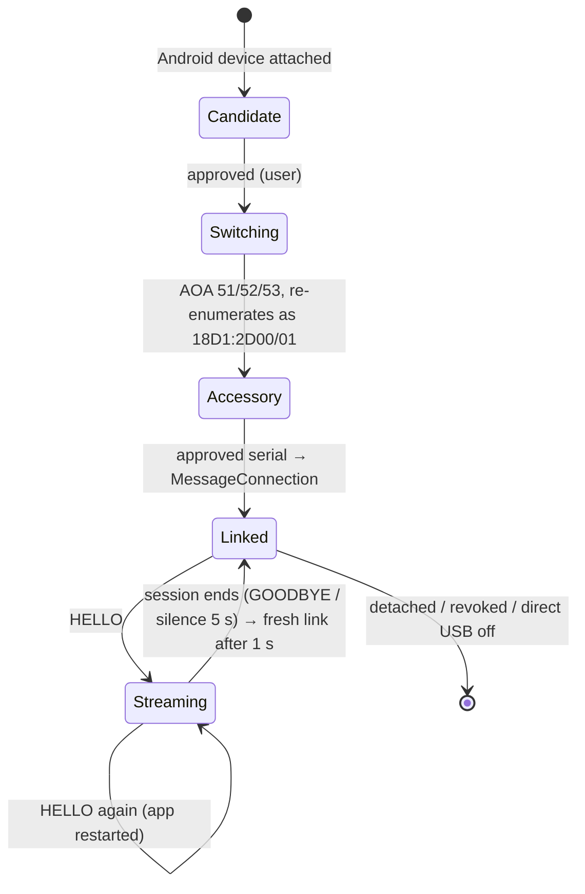
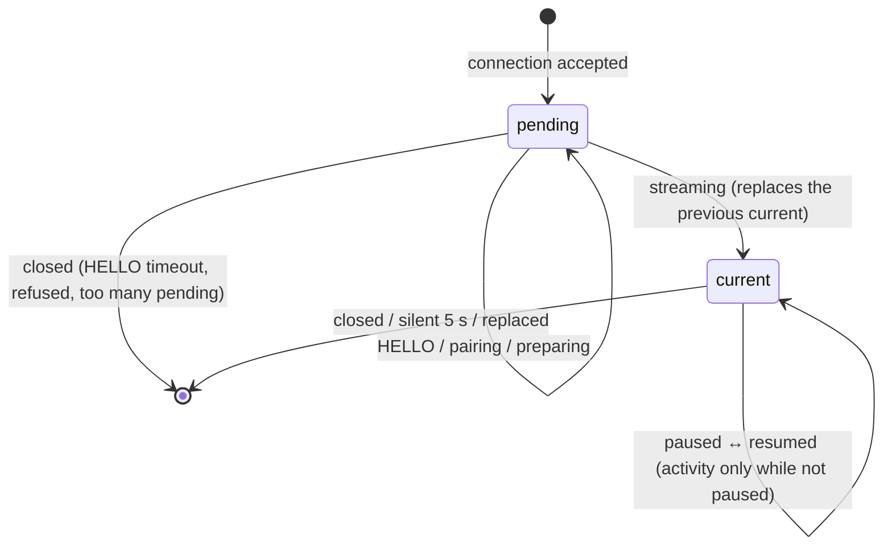

# Diagrams

Mermaid diagrams of the moving parts. The text of record is [architecture.md](architecture.md) and [PROTOCOL.md](../protocol/PROTOCOL.md); update both when a diagram changes.

## System



## Module dependencies (Mac)



## Session setup (every link)



## Pairing with commitments (Wi‑Fi)



## No router (direct link)

```mermaid
sequenceDiagram
  actor U as User
  participant T as Tablet
  participant M as Mac
  U->>T: Direct connection
  T->>T: Wi‑Fi Direct group (5 GHz, new passphrase) + BLE GATT service
  U->>M: Connect directly to the tablet
  M->>M: Location permission (to see networks)
  M->>T: BLE read: sealed {ssid, psk, session, expires}
  M->>M: remember current network, join the tablet's (CoreWLAN)
  M->>T: BLE write: sealed {host, port, session}
  T->>M: TLS connect → HELLO … (usual Wi‑Fi session)
  Note over M: session ends / user ends / tablet gone 10 s
  M->>T: GOODBYE (tablet takes its network down)
  M->>M: leave; wait ≤ 15 s for macOS auto-join
  opt still on no network
    M->>M: join the previous network from the last scan, else cycle Wi‑Fi
  end
```

## Direct USB (accessory) link lifecycle



## Receivers on the Mac


