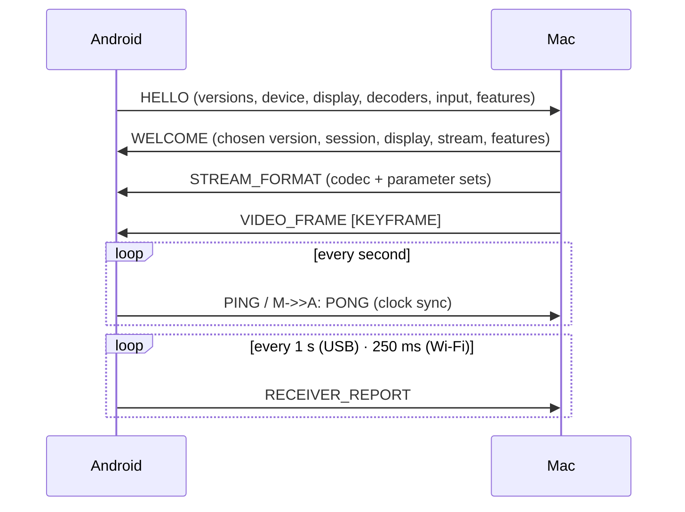

# Ginga protocol — version 1 (draft)

| | |
|---|---|
| **Status** | Draft. Specified now, implemented from milestone M3 (Mac) and M4 (Android). |
| **Transports** | Any reliable byte stream (USB/AOA bulk pipes, ADB-tunnelled TCP, Wi‑Fi TCP/TLS). There is also a datagram profile for Wi‑Fi UDP (§8, M8). |
| **Design goal** | The Mac and Android implementations can evolve independently. |

## 1. Principles

1. **One framing for every stream transport.** A 12-byte header, then a payload.
2. **JSON for control, binary for the hot path.**
   - Infrequent messages (capabilities, configuration, reports, errors) are UTF‑8 JSON objects. Unknown fields **must** be ignored and missing optional fields defaulted.
   - Per-frame and per-event messages (video, input, clock sync) are compact binary with an explicit header length, so fields can be **appended** without breaking older peers.
3. **Negotiate, don't assume.** HELLO/WELCOME exchange version ranges and feature lists. A sender must not rely on a feature the peer didn't advertise.
4. **Unknown is skippable.** Every message type added after 1.0 carries the `IGNORABLE` flag. A receiver skips an unknown `IGNORABLE` message silently. It answers any other unknown type with ERROR `unsupported` (naming the type) and keeps the connection open.
5. **Shared golden vectors.** `protocol/test-vectors/` holds byte-exact examples of every message, loaded by both the Swift and the Kotlin test suites (added in M3).

All integers are **big-endian**. Times are microseconds on the sender's monotonic clock unless noted.

## 2. Framing

```text
 0       1       2       3       4       5       6       7       8       9      10      11
+-------+-------+-------+-------+-------+-------+-------+-------+-------+-------+-------+-------+
|  'T'  |  '2'  | fver  | type  |     flags     |    stream     |        payload length         |
+-------+-------+-------+-------+-------+-------+-------+-------+-------+-------+-------+-------+
|                                      payload (length bytes)                                   |
```

| Field | Size | Meaning |
|---|---|---|
| magic | 2 | `0x47 0x4E` ("GN"). Used to resynchronise and sanity-check |
| fver | 1 | Framing version = **1**. Changes only for incompatible framing changes |
| type | 1 | Message type (§3) |
| flags | 2 | bit 0 `IGNORABLE`; bit 1 `KEYFRAME` (video); bit 2 `DISCARDABLE` (may be dropped under backpressure); bits 3–15 reserved (send 0, ignore on receipt) |
| stream | 2 | 0 control · 1 video · 2 input · 3 cursor (M9) · 4 telemetry |
| length | 4 | Payload length. Maximum 16 MiB; larger is a protocol error |

**Receivers:**

- read exactly 12 bytes, then exactly `length` bytes;
- handle frames split across or coalesced in reads (transports deliver arbitrary chunks);
- on a bad magic or `fver`, send `ERROR` and close.

## 3. Message types

| Type | Name | Direction | Stream | Encoding |
|---|---|---|---|---|
| 0x01 | HELLO | Android → Mac | 0 | JSON |
| 0x02 | WELCOME | Mac → Android | 0 | JSON |
| 0x03 | CONFIGURE | both | 0 | JSON |
| 0x04 | STREAM_FORMAT | Mac → Android | 1 | JSON |
| 0x05 | RECEIVER_REPORT | Android → Mac | 4 | JSON |
| 0x06 | KEYFRAME_REQUEST | Android → Mac | 1 | JSON |
| 0x07 | PAIRING | both (Wi‑Fi only; IGNORABLE) | 0 | JSON |
| 0x08 | DIRECT_LINK | Mac → Android (IGNORABLE) | 0 | JSON |
| 0x0E | ERROR | both | 0 | JSON |
| 0x0F | GOODBYE | both | 0 | JSON |
| 0x10 | VIDEO_FRAME | Mac → Android | 1 | binary |
| 0x11 | INPUT | Android → Mac | 2 | binary |
| 0x12 | CURSOR | Mac → Android (IGNORABLE) | 3 | binary |
| 0x13 | CURSOR_SHAPE | Mac → Android (IGNORABLE) | 3 | binary |
| 0x14 | KEY | Android → Mac (IGNORABLE) | 2 | binary |
| 0x20 | PING | both | 0 | binary |
| 0x21 | PONG | both | 0 | binary |

### 3.1 Session setup



The protocol version is the highest version within both `[min, max]` ranges. If the ranges don't overlap, reply with ERROR `incompatible-version` and GOODBYE.

**HELLO**

```json
{
  "protocol": { "min": 1, "max": 1 },
  "app": { "name": "Ginga for Android", "version": "0.1.0" },
  "device": { "manufacturer": "samsung", "model": "SM-X730", "android": "16", "id": "7f0c…",
              "name": "Galaxy Tab S11 de Kelvin" },
  "display": { "widthPx": 2560, "heightPx": 1600, "densityDpi": 274, "refreshRates": [60, 120],
               "rotation": 0, "wideColor": true },
  "decoders": [
    { "mime": "video/hevc", "profiles": ["main"], "maxWidth": 4096, "maxHeight": 2176,
      "maxFps": 120, "lowLatency": true },
    { "mime": "video/avc", "profiles": ["high"], "maxWidth": 4096, "maxHeight": 2176,
      "maxFps": 120, "lowLatency": true }
  ],
  "input": { "touch": { "maxPointers": 10 },
             "stylus": { "pressure": true, "tilt": true, "hover": true, "buttons": 1 } },
  "transport": "adb-tcp",
  "features": ["clock-sync", "receiver-report"],
  "resume": { "session": "b3f1…" }
}
```

`device.id` is a stable, app-scoped random ID.

`device.name` (optional, added in 1.x; vector `hello-device-name`) is the name the person gave the device in the system settings (Android `Settings.Global.DEVICE_NAME`; on Galaxy devices it defaults to the marketing name, e.g. "Galaxy S25 Ultra"). At most 64 characters, trimmed; omitted when the system has none. The Mac shows it wherever it names the device (menus, the device list, the pairing sheet) and names the virtual display after it, falling back to its own model table and then to `model`. It is only a label: trust and identity never depend on it. Receivers that don't send it and Macs that don't read it interoperate unchanged (JSON receivers ignore unknown fields, rule 3 at the top).

`transport` names the link: `adb-tcp` (USB through `adb reverse`), `aoa` (USB accessory mode) or `wifi-tls` (Wi‑Fi). It is informational. The Mac decides trust from the listener that accepted the connection, never from this field.

`pairingRequested: true` is sent **only over `wifi-tls`**, when the tablet has no pin for the certificate the Mac presented in the TLS handshake (§6).

`loopbackToken` (64 hex digits) is sent **only over `adb-tcp`**: the token the Mac handed the app over adb (§5). The Mac refuses an adb connection without the right token with ERROR `unauthorized` and GOODBYE `error`; the tablet retries, and at once when a new token arrives.

**WELCOME**

```json
{
  "protocol": 1,
  "session": "b3f1…",
  "mac": { "name": "MacBook Air", "os": "26.6.2", "app": "0.3.0" },
  "display": { "id": 17, "name": "Galaxy Tab S11", "looksLike": { "width": 1280, "height": 800 },
               "hiDPI": true, "refreshRate": 60, "orientation": "landscape" },
  "stream": { "codec": "hevc", "width": 2560, "height": 1600, "fps": 60, "bitrateKbps": 40000,
              "primaries": "bt709", "transfer": "bt709", "matrix": "bt709", "range": "video" },
  "features": ["clock-sync", "receiver-report", "pause"]
}
```

Features the Mac advertises: `clock-sync` (answers PING), `receiver-report` (consumes RECEIVER_REPORT), `pause` (honours CONFIGURE `request.paused`) and `cursor` (when HELLO listed it: the pointer comes as CURSOR/CURSOR_SHAPE, §3.3b, not in the video).

**HELLO `display`.** `rotation` is the tablet display's current rotation in degrees clockwise from its natural orientation (0, 90, 180 or 270). `densityDpi` is the panel's physical density (274 for the Tab S11), not Android's density bucket. Codec names are `hevc` and `h264`; receivers also accept `avc` for H.264.

**CONFIGURE.** Either side sends it:

- **Android → Mac** requests a change:
  - after the tablet rotates: `{ "request": { "orientation": "portrait" } }`;
  - after WELCOME, the user's preferred rate: `{ "request": { "refreshRate": 120 } }`. This is a preference only: the Mac's power setting decides, and it may ignore the request.
  - when it can't show video (app in the background, screen off): `{ "request": { "paused": true } }`. Send it only if WELCOME lists the `pause` feature; otherwise disconnect after about 10 s without a surface. While paused, the Mac sends no VIDEO_FRAME and stops capturing; PING/PONG and reports continue. `{ "request": { "paused": false } }` resumes, and a keyframe follows promptly even if the Mac's screen is static.
- **Mac → Android** announces the new `display` object after any display reconfiguration (orientation, mode), and the new `stream` object when the stream size changes.

**Keyframes are never left waiting.** When the receiver needs a keyframe (a new session, KEYFRAME_REQUEST, resume) and the Mac's screen is static, the Mac re-encodes the latest frame within about two frame intervals. Its `captureTimeUs` is the time of re-encoding.

A new `STREAM_FORMAT` and a keyframe always follow a stream change.

**STREAM_FORMAT**

```json
{ "codec": "hevc", "width": 2560, "height": 1600,
  "parameterSets": ["<base64 VPS>", "<base64 SPS>", "<base64 PPS>"] }
```

It is sent before the first frame and whenever the encoder changes. The next VIDEO_FRAME has the `KEYFRAME` flag.

**RECEIVER_REPORT**

```json
{ "lastFrameId": 18234, "framesReceived": 60, "framesDecoded": 60, "framesRendered": 59, "framesDropped": 1,
  "bytesReceived": 5123456, "decodeMs": { "p50": 6.1, "p95": 9.8 }, "endToEndMs": { "p50": 24.0, "p95": 31.5 },
  "decoderQueue": 0, "clockOffsetUs": -1234567, "rttUs": 850 }
```

All counters cover the report interval. Android reports once a second on USB, where bitrate is fixed and reports only feed diagnostics. On Wi‑Fi it reports every 250 ms, because the Mac's bitrate controller consumes them ([architecture §2.5](../docs/architecture.md#25-adaptive-bitrate-wifi)).

**KEYFRAME_REQUEST:** `{ "reason": "decoder-error" | "loss" | "startup", "lastDecodedFrameId": 18230 }`

**ERROR:** `{ "code": "incompatible-version" | "bad-frame" | "unsupported" | "unauthorized" | "internal", "message": "…" }`

**GOODBYE:** `{ "reason": "user" | "shutdown" | "error" | "replaced" }`

### 3.2 VIDEO_FRAME (0x10)

```text
u16  headerLength       bytes before `data`, counting this field (v1: 18)
u32  frameId            increases by 1 per encoded frame (wraps)
u64  captureTimeUs      WindowServer composition time, Mac host clock
u32  encodeDurationUs   submit → encoder output
…    (future fields; receivers skip to headerLength)
u8[] data               one access unit, Annex‑B byte stream (start codes), rest of payload
```

- Flags: `KEYFRAME` for IDR/IRAP frames. `DISCARDABLE` is set on frames that no later frame references (for example with LTR, M8).
- **Latency:** Android computes end-to-end latency per frame as `renderTime − (captureTimeUs − clockOffset)`.

### 3.3 INPUT (0x11)

```text
u16  headerLength       v1: 16
u32  sequence           increases by 1 per message
u64  eventTimeUs        Android clock (§5): MotionEvent.getEventTimeNanos()/1000
u8   kind               1 touch · 2 stylus · 3 mouse
u8   action             0 down · 1 move · 2 up · 3 cancel · 4 hover-enter · 5 hover-move · 6 hover-exit
                        · 7 pointer-down (additional pointer) · 8 pointer-up (additional pointer)
…    (future fields; skip to headerLength)
u8   pointerCount
repeat pointerCount:
  u16 recordLength      v1: 18
  u8  pointerId
  u8  toolType          0 unknown · 1 finger · 2 stylus · 3 eraser · 4 mouse
  u16 buttons           bit 0 primary · bit 1 secondary · bit 2 stylus-primary · bit 3 stylus-secondary
  u16 x, u16 y          normalized to 0…65535 across the stream's width/height (current orientation)
  u16 pressure          0…65535 (0 when hovering)
  i16 tiltX, i16 tiltY  −32767…32767 ↔ −90°…+90°
  u16 distance          hover distance, device units (0 if unknown)
  …   (future fields; skip to recordLength)
```

Coordinates are normalized, so the Mac maps them into `CGDisplayBounds(displayID)` no matter the stream's scaling.

- **Which pointer changed.** For `pointer-down` (7) and `pointer-up` (8) the first record is the pointer that went down or up; the other records carry the remaining pointers' current state. For `down`, `up` and `cancel` the first record is the pointer concerned.
- **Tilt** follows the W3C Pointer Events convention (as in Chromium). `tiltX` is positive when the pen's top leans toward +x (right), and `tiltY` is positive when it leans toward +y (down the screen).

### 3.3b CURSOR (0x12) and CURSOR_SHAPE (0x13) — the pointer as a side channel

When HELLO lists the `cursor` feature (the tablet draws the pointer itself) and WELCOME lists it too, the Mac leaves the pointer **out of the video** and sends it separately. Moving the pointer over a still screen then costs a 24-byte message instead of a captured, encoded and decoded frame, and the pointer follows with the link's latency instead of the video pipeline's. Both types are IGNORABLE, and a Mac that doesn't send `cursor` in WELCOME keeps the pointer in the video.

```text
CURSOR (0x12)
u16  headerLength       v1: 24
u32  sequence           increases by 1 per message
u64  timeUs             Mac clock (§5): when the pointer was there
u16  x, u16 y           the hotspot, normalized to 0…65535 across the display (as INPUT)
u8   visible            0 = hidden (the pointer is on another display)
u8   reserved           0
u32  shapeId            the CURSOR_SHAPE to draw (never 0 while visible)
…    (future fields; skip to headerLength)

CURSOR_SHAPE (0x13)
u16  headerLength       v1: 14
u32  shapeId            nonzero; the same image always has the same id
u16  width, u16 height  image size in stream pixels (the display's backing scale)
u16  hotspotX, hotspotY in image pixels
…    (future fields; skip to headerLength)
u8[] png                the image, PNG with alpha, rest of payload
```

- The Mac sends a shape before the first CURSOR that uses it, and each shape once per session; receivers cache shapes by id for the session.
- Positions arrive at most once per display refresh (latest wins). The tablet draws the image at `x·viewWidth/65535 − hotspotX·s`, `y·viewHeight/65535 − hotspotY·s`, where `s` is the view's pixels per stream pixel.
- The pointer also moves when the tablet's own touch or pen input moves it; the next CURSOR reports that.

### 3.3c KEY (0x14) — a keyboard attached to the tablet

When HELLO lists `keyboard`, the tablet forwards its hardware keyboard (a keyboard cover, a Bluetooth or USB keyboard) as physical keys, the way Sidecar forwards an iPad keyboard. The Mac applies its own keyboard layout, as for any keyboard plugged into it. The on-screen keyboard is not forwarded.

```text
u16  headerLength       v1: 20
u32  sequence           increases by 1 per message
u64  eventTimeUs        Android clock (§5)
u8   action             0 down · 1 up (a held key repeats with more `down`s)
u8   reserved           0
u16  usage              USB HID usage, Keyboard/Keypad page 0x07 (0x04 = A … 0xE0–0xE7 = modifiers)
u16  modifiers          bit 0 left control · 1 left shift · 2 left alt · 3 left meta
                        · 4 right control · 5 right shift · 6 right alt · 7 right meta · 8 caps lock on
…    (future fields; skip to headerLength)
```

- Modifier keys are keys too (usage 0xE0–0xE7, down and up). `modifiers` is the state after this event.
- The Mac maps meta (the ⊞/Samsung key) to ⌘ and alt to ⌥, as macOS does for a PC keyboard; `input.commandKey` in the Mac's configuration can put ⌘ on control instead.
- Keys with no HID usage (Android-only keys such as the DeX key) are not sent.

### 3.4 PING / PONG (0x20 / 0x21) — clock sync

```text
PING: u32 id, u64 t1 (sender clock at send)
PONG: u32 id, u64 t1 (echoed), u64 t2 (responder clock at receipt), u64 t3 (responder clock at send)
```

Receivers ignore bytes after the defined fields, which leaves room for later extensions.

The initiator records `t4` on receipt. Then:

- offset θ = ((t2 − t1) + (t3 − t4)) / 2
- round trip δ = (t4 − t1) − (t3 − t2)

θ is the **responder's clock minus the initiator's clock** (when Android pings, θ = Mac − Android, so a Mac timestamp `T` corresponds to Android time `T − θ`). Keep the θ of the minimum-δ sample over a sliding window of about 16 samples. Clocks are defined in §5.

## 4. Flow control and ordering

- **Stream transports** deliver messages in order.
- **Senders** apply latest-frame-wins before writing: if the transport can't accept a video frame, discard queued `DISCARDABLE` frames, never keyframes, and let the receiver request a keyframe if needed. Control and input messages are never discarded.
- **Receivers** never queue more than one decoded frame for display.
- **Liveness.** While streaming, the receiver sends PING every second, paused or not. The Mac drops a receiver it hasn't heard from for 5 s. A USB accessory link doesn't report a tablet app that died, so this is how the Mac notices; it then offers a fresh link. The tablet likewise drops a link that is silent for 4 s (accessory) or 5 s (adb, Wi‑Fi), including when a write stays blocked, and reconnects.
- **Restart.** A HELLO on a connection that is already pairing, preparing or streaming means the tablet's app restarted on the same link. The Mac ends that session and handles the HELLO as a new one on the same connection.
- **Quitting.** The Mac sends GOODBYE `shutdown` to every receiver when it quits normally. Receivers reconnect later after `shutdown`, not after `user`.
- **Start of a link.** A new accessory link may begin with the tail of the previous link's last write. Until its first valid frame, a receiver may skip bytes up to a plausible header (magic, framing version, length ≤ 16 MiB).

## 5. Transport bindings

| Transport | Binding |
|---|---|
| ADB (M4) | The Mac listens on **TCP 127.0.0.1:47800**. The Mac runs `adb reverse tcp:47800 tcp:47800`, and the tablet connects to `127.0.0.1:47800`. Loopback only: the stream is never exposed on the LAN without pairing. **Token:** any process on the Mac, and any app on the tablet (through the reverse forward), can open that port, so after each reverse the Mac hands the app a fresh random token (32 bytes, new per Mac app start): `adb -s SERIAL shell 'read t; am broadcast -f 32 -a dev.ginga.action.LOOPBACK_TOKEN -n dev.ginga.receiver/dev.ginga.receiver.adb.LoopbackTokenReceiver --es token "$t"'`, with the token on stdin (never on a command line). The receiver requires the `DUMP` permission, which only the adb shell holds, so no other app can plant or read it. HELLO carries it back (`loopbackToken`, §3.1). A refused connection makes the Mac deliver it again (at most every 5 s). |
| AOA (M6) | Accessory strings: manufacturer `Ginga`, model `Ginga Receiver` (the tablet's accessory filter matches both), description `Second display for your Mac`, version `1`, URI empty, serial `1`. Messages are framed exactly as over TCP; the host sends a zero-length packet after writes that end on a packet boundary. There is no HELLO timeout on this link (the app starts only after the user answers Android's prompt). When a session ends while the device stays plugged in, the Mac offers a fresh link, so the tablet can say HELLO again without replugging. |
| Wi‑Fi (M7) | TLS 1.3 over TCP on the port advertised via Bonjour `_ginga._tcp`. The system picks the port each time the Mac starts listening, so the tablet resolves the service again before every connection (including reconnects) instead of reusing an address. |

**Handshake order (all stream transports):**

1. The tablet connects and sends HELLO. The Mac closes the connection if HELLO doesn't arrive within 5 s.
2. The Mac answers with WELCOME, then STREAM_FORMAT, then a keyframe.
3. Clocks, used by every `…TimeUs` field:
   - **Mac:** `mach_absolute_time` converted to µs.
   - **Android:** `System.nanoTime() / 1000` (CLOCK_MONOTONIC, the same base as `MotionEvent` event times).

## 6. Discovery and security (Wi‑Fi)

- **Bonjour** service type `_ginga._tcp`. TXT keys: `pv` (max protocol version), `id` (the first 12 hex digits of the Mac's certificate fingerprint: a stable instance ID, not a secret and not a pin), `name`.
- **Pairing:**
  - TLS 1.3 with a self-signed identity on each side. Each is a P‑256 key with an X.509 v3 certificate (ECDSA‑SHA256). The tablet presents its certificate as a TLS client certificate. Neither side validates a chain; each pins the other's certificate fingerprint (SHA‑256 of the DER).
  - **Numeric comparison with a commitment**, as in Bluetooth LE Secure Connections. The 6-digit code covers both certificates and a fresh 32-byte random nonce from each side. The tablet commits to its nonce before it learns the Mac's and reveals it only afterwards. A man in the middle must commit toward the Mac before any nonce is known, so it gets one guess at the code per attempt (1 in 10⁶) instead of searching offline for certificates whose codes collide.
    - `commitment = SHA-256(tabletFingerprint ‖ macFingerprint ‖ tabletNonce)`
    - `code`: the first 4 bytes of `SHA-256(macFingerprint ‖ tabletFingerprint ‖ macNonce ‖ tabletNonce)` as a big-endian unsigned integer, mod 1 000 000, zero-padded to 6 digits. Shown as `053 656`.
    - Fingerprints are the raw 32-byte digests. Nonces and commitments travel as 64 lowercase hex digits.
    - **Vector:** fingerprints of 32 × `0x11` (Mac) and 32 × `0x22` (tablet), nonces of 32 × `0x33` (Mac) and 32 × `0x44` (tablet) give commitment `052c957131b84f9b12e9519024c730dbf4fa95abac4b8d2e5b1118b2cef8ec89` and code **`053656`**.
  - **Flow**, after TLS, when the tablet's HELLO lists the `pairing` feature. Each step is a PAIRING message:

    | # | From | Message |
    |---|---|---|
    | 1 | Mac | `{"state":"required","name":"<Mac name>"}`, when the tablet isn't pinned, or when its HELLO has `pairingRequested` (a pinned tablet otherwise gets WELCOME right away). A successful exchange replaces the Mac's pin |
    | 2 | tablet | `{"state":"commit","commitment":"<hex>"}` |
    | 3 | Mac | `{"state":"nonce","nonce":"<hex>"}` |
    | 4 | tablet | `{"state":"reveal","nonce":"<hex>"}`. The Mac checks it against the commitment. Both screens now show the code |
    | 5 | tablet | `{"state":"confirmed"}`, when its user confirms the codes match (the Mac's user answers on the Mac) |
    | 6 | Mac | `{"state":"paired","name":"<Mac name>"}` once both users confirmed. The Mac has pinned the tablet; the tablet pins the Mac. WELCOME follows |

    - Steps must come in this order. A missing, repeated or out-of-order step, a malformed value, or a reveal that doesn't match the commitment ends the attempt: the Mac sends `{"state":"rejected"}` and GOODBYE `"error"`.
    - Either user may decline at any time: that side sends `{"state":"rejected"}`, then GOODBYE `"user"`, and closes.
    - A tablet with no pin for the Mac's certificate (it forgot the Mac, or the Mac's identity changed) sends `pairingRequested: true` in HELLO, so the Mac pairs even though it still knows the tablet. The tablet never trusts a Mac on first use: if a WELCOME comes anyway (a Mac that predates the field), it ends the session with GOODBYE `"error"` and asks its user to forget the tablet on the Mac.
    - An attempt times out after 120 s. The Mac shows one pairing prompt at a time and declines a second request meanwhile.
    - Receivers ignore `state` values they don't know.
    - A Wi‑Fi HELLO without `pairing` gets ERROR `unsupported` and GOODBYE.
    - On later connections the tablet checks the Mac's pinned fingerprint, and a different certificate means pairing again.
    - Pre-release history: the first pairing draft had no nonces (`code = SHA-256(macFingerprint ‖ tabletFingerprint)`, vector `983997`). Its code could be steered by a man in the middle, and it is not supported.
  - The Mac stores the tablet's pin in the Keychain; the tablet stores the Mac's pin in the Android Keystore.
- USB transports rely on physical trust: the user approved the AOA or ADB prompt. On top of that, only devices the Mac's user approved get an AOA session, and adb connections must carry the loopback token (§5).

## 6b. Direct link: no router (Wi‑Fi, M7b)

For a hotel, a train or anywhere without a usable network: the tablet creates its own Wi‑Fi network, the Mac joins it, and the usual Wi‑Fi session (TLS 1.3, pinning, pairing) runs on it. The Mac leaves its current Wi‑Fi network for the duration, and only when its user asks.

- **Direct key.** When HELLO lists `direct-link`, over an authenticated session (USB, or Wi‑Fi with a pinned tablet), the Mac sends DIRECT_LINK after WELCOME:

  ```json
  { "keyId": "0102030405060708", "key": "<64 hex digits>" }
  ```

  The key is 32 random bytes the Mac keeps per tablet (in its keychain) and resends each session; the tablet keeps it per Mac (in its keystore). The key never travels outside an authenticated session.
- **The tablet's network.** On its user's request, the tablet creates a WPA2/WPA3 network on 5 GHz: a Wi‑Fi Direct group owner (`WifiP2pConfig`, SSID `DIRECT-T2-<first 4 hex digits of keyId>`) or a local-only hotspot. The passphrase is new for every session, and the network exists only while the session does.
- **Handing over the credentials: Bluetooth LE.** The tablet runs a GATT service while the network is up:

  | UUID | What |
  |---|---|
  | `474ED1EC-7D1A-4F5B-9A6E-0E2A6D3C0001` | service (advertised) |
  | `474ED1EC-7D1A-4F5B-9A6E-0E2A6D3C0002` | credentials, read: `keyId (8) ‖ nonce (12) ‖ AES-256-GCM ciphertext ‖ tag (16)` |
  | `474ED1EC-7D1A-4F5B-9A6E-0E2A6D3C0003` | Mac address, write: same layout |

  - Keys: `HKDF-SHA256(ikm = direct key, salt = "ginga-direct-v1", info = "credentials" | "address", 32 bytes)`. The AAD is the 8-byte keyId. Nonces are random.
  - Credentials plaintext: `{"ssid": "…", "psk": "…", "session": "<32 hex>", "expires": <unix seconds>}`. The Mac refuses expired credentials.
  - Address plaintext: `{"host": "<the Mac's IP on the tablet's network>", "port": <Wi‑Fi listener port>, "session": "<same>"}`. The tablet refuses another session's address, then connects to it as over any Wi‑Fi (TLS, pinning, pairing if needed).
  - Nothing here is ever logged or put on a command line.
- **Vector** (direct key 32 × `0x55`, keyId `0102030405060708`, nonce 12 × `0x09`):
  - credentials subkey `75bc03cb45573842d8a842de4be2e8af48b937dd59f5d8fa3a8f4894b0a94aee`; the plaintext `{"expires":1790000000,"psk":"gn-Example-Passphrase","session":"00112233445566778899aabbccddeeff","ssid":"DIRECT-Ginga-0102"}` gives `01020304050607080909090909090909090909099f2fa452568ca28a265f8f20a285763f7681dcb148c12a085ae117d046ae61bcb27831e6ebea98d66170f2e14d9ced2dbf867fa7668ca1cbb75dc180323f700b276345f79d8e5fcfbe22eacba5221bf34d743879225aeb1e6022a12b24f2753566f99f9413d38173182cc6c39505376f99ae5c66985a096006fdff5857755fb50029c8a9e706f8f0c9da5beb`;
  - address subkey `ab1e4ff1ce626425d6a274df7b484e86ee138a2e44b5085952d184dabc27948b`; `{"host":"192.168.49.23","port":55471,"session":"00112233445566778899aabbccddeeff"}` gives `0102030405060708090909090909090909090909923619aa87d7eb78090f3d480e07fb8aa350dbc7ac692467bc86d1d5f174cc5a8bc58d94045ddc34b17c4a1f956830bb6bfcddbbb3051fe54a47db3099df512b1dc54407012e375f7edd330268bac91be8335a2c4959b014548f3eebeb781cd44faf`.
- **The Mac's side.** On its user's click: scan for the service, read and decrypt the credentials, remember the current Wi‑Fi network, join the tablet's with CoreWLAN, write its address, accept the session. When the session ends (or the user ends it), leave the tablet's network and return to the previous one.
- **Wi‑Fi Aware (NAN)** would make this simpler (no router, no network switch on the Mac), and the Tab S11 supports it (`android.hardware.wifi.aware`). But the macOS 26 SDK's `WiFiAware.framework` marks every symbol `@available(macOS, unavailable)`: it is iOS/iPadOS 26 only. It would enter as one more `ByteTransport` when Apple opens it on macOS (architecture ADR‑25).

## 7. Versioning rules

| Change | Allowed within protocol 1? | How |
|---|---|---|
| New JSON field | ✅ | Receivers ignore unknown fields; define a default |
| New binary field | ✅ | Append before the variable data and bump `headerLength` / `recordLength` |
| New message type | ✅ | Set `IGNORABLE`; send only if the peer advertised the feature |
| Changing or removing a field, reordering binary fields | ❌ | Needs protocol 2, negotiated via HELLO/WELCOME |
| Framing change | ❌ | Needs `fver` 2 |

## 8. Datagram profile (Wi‑Fi UDP, M8 — outline)

Control stays on TLS/TCP. Video moves to UDP packets of ≤ 1200 bytes:

```text
u16 magic 'GN' · u8 fver · u8 type (0x40 VIDEO_FRAGMENT · 0x41 FEC_PARITY · 0x42 NACK)
u32 frameId · u16 fragmentIndex · u16 fragmentCount · u8 fecDataCount · u8 fecParityCount
… payload … · AES‑GCM tag (16) — key from the TLS exporter, nonce = frameId‖fragmentIndex
```

- Reed–Solomon parity is 10–20% per frame, adapted to measured loss.
- The receiver waits at most about 10 ms for missing fragments, then sends NACK.
- A frame that still can't be recovered triggers LTR recovery (H.264 profile) or a KEYFRAME_REQUEST.

## 9. Golden test vectors (M3)

`protocol/test-vectors/<name>.json`, generated by the Swift implementation (`ginga protocol-vectors`):

```json
{ "name": "input-stylus-hover", "description": "…", "hex": "474E0111…",
  "decoded": { "type": "INPUT", "flags": 0, "stream": 2, "fields": { "sequence": 7, "kind": 2, "action": 5, "pointers": [ … ] } } }
```

- `decoded.type` is the message name from §3 (or `UNKNOWN` plus `rawType` for unknown types). `flags` and `stream` are the header integers.
- **Binary messages** (VIDEO_FRAME, INPUT, CURSOR, CURSOR_SHAPE, PING, PONG): `fields` holds every field by the name used in §3, with byte arrays as lowercase hex strings (`dataHex`, `pngHex`) and CURSOR's `visible` as a boolean. Implementations must:
  1. decode `hex` to exactly `fields`;
  2. re-encode `fields` to exactly `hex` (byte-exact).
- **JSON messages:** `fields` is the payload object. Decoding must give the same JSON value. Re-encoding must produce the same header (type, flags, stream) and a payload that parses to the same JSON value. Key order and whitespace may differ between JSON libraries.
- Vectors are append-only; a changed vector means a protocol-version change.
